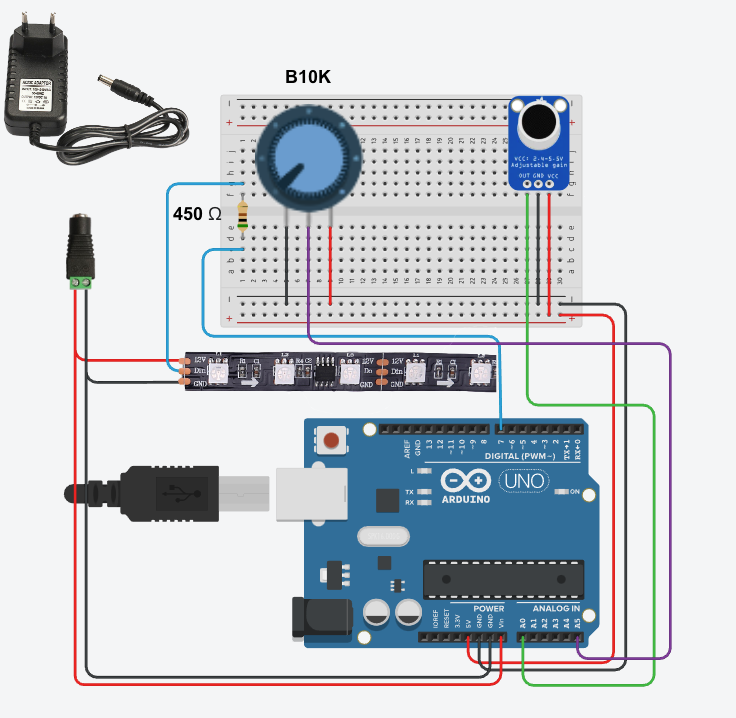

# MicroLED
Real time music visualizer using Arduino

### Components
* Tools for soldering;
* Power adapter 12V 1A;
* 5.5mm x 2.1mm Female DC Power Plug;
* WS2811 5M 60led LED pixel;
* B10K Potentiometer;
* GY-MAX4466 Electret Microphone Amplifier;
* Breadboard;
* A lot of M-M wires (>20);
* Resistor 450 Ω;
* Arduino Uno (Actually, you can use Arduino Nano);
* USB-A to USB-B cable.

**See connection scheme below:**


### Setup

* You need to download [Arduino IDE](https://www.arduino.cc/en/software);
* Connect your Arduino UNO to computer with USB-A to USB-B cable;
* Open ```micro-led/micro-led.ino``` in Arduino IDE;
* Select **Arduino UNO** in Tools->Board;
* Select Sketch->Upload;
* Disconnect Arduino UNO from computer and assemble circuit;
* Plug in power adapter.

**P.S: You can change microphone sensitivity with B10K Potentiometer.**

Check it in my tiktok 🙂 -> [TikTok video](https://vm.tiktok.com/ZMdcVfV1o)
\
\
\
© Stanislav Vereskovsky, 2021
